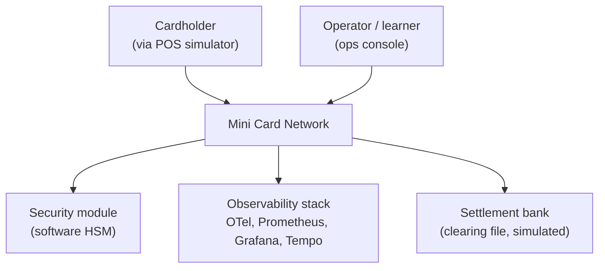
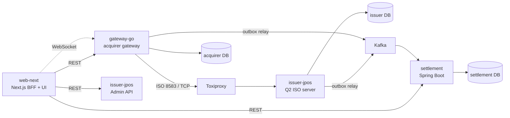
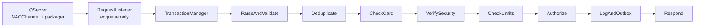
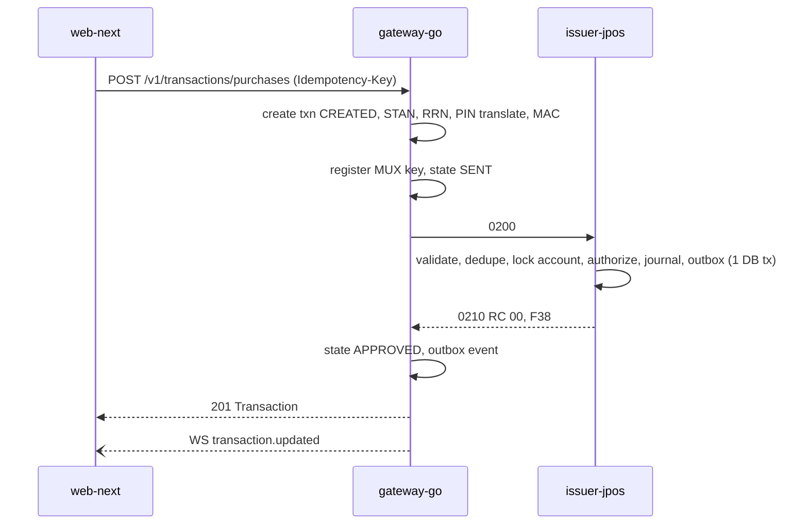
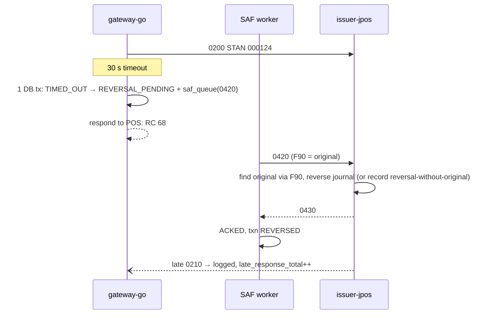
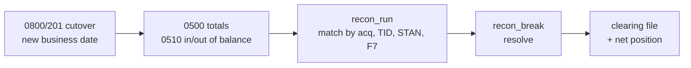

# Software Architecture Document (SAD)

Version 1.0 · 2026-09-21 · Owner: Tech Lead

## 1. Scope

This document describes the architecture of Mini Card Network v1.0: its drivers, structure (C4 levels 1–3), runtime behavior, cross-cutting concerns, deployment and technology. Wire formats are specified in `03-iso8583-interface-spec.md`; REST/WS contracts in `contracts/`; storage in `05-data-model.md`.

Roles mapped from a real card network: POS terminal → **web-next** (simulator); acquirer host → **gateway-go**; switch/scheme → **gateway-go `cmd/switch`** (from Sprint 10; before that the gateway connects to the issuer directly); issuer host → **issuer-jpos**; settlement/clearing → **settlement**.

## 2. Architecture drivers

### 2.1 Functional requirements

| ID | Requirement | Epic |
| --- | --- | --- |
| FR-01 | POS simulator creates purchase, cash, refund, balance inquiry, pre-auth, completion; entry mode chip/swipe/manual | E3, E6 |
| FR-02 | Gateway signs on (0800/001) at start and signs off (0800/002) on shutdown | E2 |
| FR-03 | Echo (0800/301) on schedule; N misses ⇒ link down ⇒ reconnect with backoff + jitter | E2 |
| FR-04 | Support 0100/0110 and 0200/0210 | E3 |
| FR-05 | Issuer validates card, status, expiry, limits, balance; returns standard field 39 | E3 |
| FR-06 | Pre-auth creates a hold; 0220 completion settles it; holds expire | E6 |
| FR-07 | Timeout ⇒ 0420 reversal referencing the original via field 90 | E4 |
| FR-08 | SAF persists advices and repeats as 0x21 until acknowledged | E4 |
| FR-09 | Issuer detects duplicates and replays the original response | E4 |
| FR-10 | Late responses are logged, measured and ignored | E4 |
| FR-11 | PIN (field 52, ISO format 0) and MAC (field 64/128) verified through the security module | E5 |
| FR-12 | Dynamic key exchange via 0800/161 | E5 |
| FR-13 | Field 55 TLV parsing; ARQC check and ARPC generation (simulated) | E6 |
| FR-14 | Cutover (0800/201) by business date; 0500/0510 reconciliation totals | E7 |
| FR-15 | Clearing records, reconciliation breaks, clearing file | E7 |
| FR-16 | Stand-in processing with advices when the issuer is down | E8 |
| FR-17 | Velocity rules per card and time window | E8 |
| FR-18 | Console: live feed, journey, message lab, chaos lab, cards, keys, settlement, network | E1–E9 |

### 2.2 Quality attribute scenarios (NFRs)

| ID | Attribute | Scenario | Measure |
| --- | --- | --- | --- |
| NFR-01 | Performance | 200 TPS purchases for 10 min on a laptop | Issuer p99 < 100 ms; end-to-end p99 < 300 ms |
| NFR-02 | Correctness | 10,000 transactions under every chaos scenario | Σ ledger = Σ approved − Σ reversed; 0 discrepancy |
| NFR-03 | Durability | `kill -9` gateway mid-load | 0 lost advices; all reversals delivered after restart |
| NFR-04 | Availability | Issuer connection drops | Reconnect < 5 s; STIP engages within 3 missed echoes (Sprint 10+) |
| NFR-05 | Idempotency | Same request sent twice (REST or ISO) | One ledger effect; identical response |
| NFR-06 | Security | Any log, DB row, API response, fixture | No full PAN, track data, CVV, PIN, PIN block, clear key (CI scanner) |
| NFR-07 | Auditability | Card status, limit or key change | Append-only audit record with actor and before/after |
| NFR-08 | Observability | Any transaction | Traceable by RRN across all services in < 1 min |
| NFR-09 | Operability | SIGTERM during load | Stop accepting, drain in-flight ≤ 30 s, sign off, exit 0 |
| NFR-10 | Modifiability | New transaction type | Added via new participant/strategy + config; no edits to existing participants |

### 2.3 Constraints

Single laptop (Docker Compose); no real HSM, scheme access or real cards; ISO 8583:1987 ASCII variant defined by our own spec; all docs and code in English.

## 3. C4 Level 1 — System context

## 4. C4 Level 2 — Containers

| Container | Technology | Responsibility | Owns data | Interfaces |
| --- | --- | --- | --- | --- |
| web-next | Next.js App Router, TypeScript | POS simulator, ops console, BFF | none (stateless) | REST to GW/ISS-Admin/SET; WS from GW |
| gateway-go | Go | Acquirer host: REST/WS API, ISO build/send, MUX, SAF, chaos control, switch (S10+) | `acquirer` DB | REST+WS (openapi), ISO client, Kafka producer (outbox) |
| issuer-jpos | Java 25, jPOS Q2, Javalin | Issuer host: authorization, ledger, keys, admin API | `issuer` DB | ISO server, REST admin API, Kafka producer (outbox) |
| settlement | Java 25, Spring Boot | Clearing, reconciliation, net position, clearing file | `settlement` DB | Kafka consumer, REST API |
| Toxiproxy | Toxiproxy | Fault injection on the ISO link | — | Admin API used by gateway `chaos` |
| PostgreSQL | PostgreSQL 16 | Three separate databases | — | — |
| Kafka | Kafka (KRaft) | Transaction events | topics | — |

Rule: no service reads another service's database. Cross-service data flows only through ISO, REST or Kafka events (ADR-004).

## 5. C4 Level 3 — Components

### 5.1 issuer-jpos

Participants are adapters calling application use cases (`AuthorizePurchase`, `ReverseTransaction`, `CompleteHold`, `HandleNetworkManagement`, `RecordReconciliationTotals`). Selector groups route by MTI class. Other components: `AdminApi` (Javalin QBean), `OutboxRelay` (QBean polling `outbox_event`), `SecurityModuleAdapter` (JCESecurityModule), `HoldExpiryJob`.

### 5.2 gateway-go

| Component | Responsibility | Pattern |
| --- | --- | --- |
| `api` | Strict OpenAPI server, WS hub, problem+json | Adapter, Observer (hub) |
| `txn` | Transaction aggregate and state machine | State, Domain model |
| `iso8583` | Codec and packager | Strategy per field type, Builder for messages |
| `isonet` | Framing, connection manager, sign-on, echo, reconnect | Supervisor loop |
| `mux` | Pending-request registry, timeouts, late-response hook | Correlation identifier |
| `saf` | Durable retry of advices | Store-and-forward, competing consumers |
| `hsm` | PIN translate, MAC | Port/Adapter |
| `switch` | Routing, circuit breaker, STIP | Strategy (routing), Circuit breaker |
| `store` | pgx + sqlc repositories, unit of work | Repository, Unit of Work |
| `obs` | Logs, metrics, traces, masking | Decorator |

### 5.3 web-next

Feature-sliced App Router app. BFF route handlers (`src/app/api`) call backends with service credentials and return typed DTOs. Shared layers: `ui` (design system), `motion`, `realtime`, `api` (generated), `i18n` (Easy/Expert glossary).

### 5.4 settlement

Hexagonal Spring Boot app: Kafka consumers → `IngestEvent` (inbox) → `clearing_record`; `ReconcileBusinessDay` (pure domain function) → `recon_run` + `recon_break`; `ResolveBreak`; `GenerateClearingFile`; REST controllers.

## 6. Runtime views

### 6.1 Purchase (0200/0210)

### 6.2 Timeout and reversal

### 6.3 SAF retry

Worker loop: claim due rows with `FOR UPDATE SKIP LOCKED`; send x20 on first attempt, x21 afterwards; on ack mark `ACKED`; on timeout or error `next_retry_at = now + min(60s, random(0, 2s·2^attempts))`; after `max_attempts` mark `DEAD`, emit `saf_dead_total` and an ops event.

### 6.4 Pre-auth and completion

0100 creates `auth_hold` (available balance decreases, ledger unchanged). 0220 completion posts the journal for the final amount (≤ hold for v1) and releases the remainder. `HoldExpiryJob` releases expired holds and emits `HoldExpired`.

### 6.5 Cutover and reconciliation

In-flight transactions at cutover belong to the business date in their request's field 15 as assigned by the gateway at send time (ISO spec §7.6).

### 6.6 Stand-in (Sprint 10)

Switch circuit breaker opens after 3 consecutive echo failures or > 50% errors over 20 requests. While open, STIP approves transactions ≤ STIP limit, generates 0120/0220 advices into the switch SAF, and returns RC per STIP rules. Half-open after 30 s; one probe echo closes it.

## 7. Cross-cutting concerns

### 7.1 Security and PCI DSS

- PAN stored as `pan_enc` (AES-GCM with DEK wrapped by KEK from env for the lab), `pan_hash` (HMAC-SHA256 with a separate key), `masked_pan`. Browser never receives full PAN.
- No storage of track data, CVV or PIN block after authorization. PIN verified via PVV in the security module.
- Key hierarchy: LMK (security-module master, env-provided test value) → ZMK (per counterparty) → ZPK/ZAK; TPK/TAK per terminal; CVK, PVK issuer-only. Keys stored only as cryptograms under LMK with KCV.
- Log masking in every service; CI `pci-scan` greps logs, fixtures and DB dumps for PAN-like numbers passing Luhn, and for field 52/35 patterns.
- Admin actions (block card, change limit, rotate key, resolve break) require confirmation in UI and write `audit_log`. Authentication for the console is out of scope for v1 (local lab) but BFF passes an `X-Actor` header so audit is complete.

### 7.2 Idempotency and deduplication

| Boundary | Key | Behavior on duplicate |
| --- | --- | --- |
| REST (state-changing) | `Idempotency-Key` + route | Return stored response (same status/body) for 24 h |
| ISO at issuer | (acquirer ID, TID, STAN, F7, MTI class, business date) | Replay stored response |
| SAF | `saf_queue.id` per original | One active advice per original |
| Kafka consumer | `event_id` in `inbox_event` | Skip, ack |

### 7.3 Concurrency and consistency

- Issuer authorization: pessimistic row lock on `account` within one transaction (write a new ADR if measured contention forces a different strategy). Optimistic `version` used by admin updates.
- Gateway: one DB transaction per state transition; state transitions validated by the state machine; MUX registration before socket write.
- Outbox in the same transaction as business writes; relay publishes at-least-once; consumers idempotent.

### 7.4 Resilience settings

| Setting | Default | Where |
| --- | --- | --- |
| ISO request timeout (0100/0200) | 30 s | gateway `ISO_REQUEST_TIMEOUT` |
| Advice ack timeout (0x20/0x21) | 10 s | gateway/switch |
| Echo interval / misses before down | 60 s / 3 | gateway, switch |
| Reconnect backoff | 1 s → 30 s, full jitter | isonet |
| SAF backoff | base 2 s, cap 60 s, full jitter, max 20 attempts | saf |
| Circuit breaker | open: 3 echo fails or >50% of 20; half-open after 30 s | switch |
| HTTP server timeouts | read 5 s, write 35 s, idle 60 s | gateway |
| Graceful drain | 30 s | all services |

### 7.5 Error model

- ISO: domain errors → field 39 via one mapper per host (ISO spec §8).
- REST: RFC 9457 `application/problem+json` with `type` URIs under `https://mcn.local/problems/` (catalogue in `04-api-contract.md`).
- Never leak stack traces or internal IDs beyond `trace_id`.

### 7.6 Observability

- Logs: JSON, fields `ts, level, service, trace_id, span_id, rrn, stan, mti, rc, tid, event`.
- Traces: OpenTelemetry SDK in all services, OTLP to the collector, Tempo backend. ISO correlation per ISO spec §10.
- Metrics (Prometheus): `mcn_tx_total{mti,rc}`, `mcn_tx_latency_seconds` (histogram), `mcn_reversal_total`, `mcn_late_response_total`, `mcn_saf_depth`, `mcn_saf_dead_total`, `mcn_link_up{endpoint}`, `mcn_stip_active`, `mcn_ledger_discrepancy` (must be 0), `mcn_outbox_lag_seconds`.
- Dashboards and alerts delivered in MCN-901.

### 7.7 Configuration

Environment variables, validated at startup into typed config (Go struct with validation, Java records with a validator). `.env.example` documents all variables; no secrets committed.

### 7.8 Feature flags

Simple env-driven flags per slice (`FF_SLICE_S3A=true`). The BFF exposes enabled flags to the UI; screens behind a disabled flag are hidden from navigation. Flags are removed one release after the slice is stable.

### 7.9 Frontend motion system

Motion explains cause and effect; nothing is decorative.

Principles: (1) every animation is triggered by a real event; (2) left-to-right = request, right-to-left = response; (3) interactions ≤ 250 ms and interruptible; (4) `prefers-reduced-motion` replaces motion with 120 ms fades; animate only `transform` and `opacity`.

| Token | Value | Use |
| --- | --- | --- |
| `dur.instant` | 100 ms | hover, press, focus |
| `dur.fast` | 180 ms | toggles, badges, bitmap cells |
| `dur.base` | 260 ms | panels, new feed rows, scenario switch |
| `dur.slow` | 420 ms | transaction result, settlement step done |
| `dur.travel` | 600–900 ms | packet travelling along a journey or link |
| `ease.out` | cubic-bezier(0.22, 1, 0.36, 1) | enter |
| `ease.in` | cubic-bezier(0.4, 0, 1, 1) | exit (30% shorter than enter) |
| `spring.snappy` | stiffness 500, damping 32 | badges, check marks |
| `spring.soft` | stiffness 220, damping 26 | cards, layout changes |
| `stagger` | 40 ms, max 8 items | lists, steps |

Catalogue per screen (implemented in the design canvas and specified per story): live feed row slide-in with status flash and 500 ms batching above 5 events/s; KPI count-up; POS processing state with spinner and dots, result pop and decline shake; journey autoplay with pulsing current step and travelling dot; bitmap diagonal flip on message change; chaos card highlight and money verification flash; card lock overlay; KCV flip after rotation; PIN block rows revealing XOR; settlement step check pop and break collapse; network links flowing in request direction, red dashed and still when down.

Implementation: `LazyMotion` + `domAnimation`, `AnimatePresence` for enter/exit, `layout`/`layoutId` for reordering and active indicators; tokens in `shared/motion/tokens.ts`; performance budget 60 fps, ≤ 12 concurrent looping animations; E2E runs with animations disabled.

## 8. Deployment (local)

| Service | Port(s) | Notes |
| --- | --- | --- |
| web-next | 3000 | BFF + UI |
| gateway-go | 8080 (HTTP/WS), 9464 (metrics) | connects to `toxiproxy:18000` |
| toxiproxy | 8474 (admin), 18000 (proxy → issuer:8000) | |
| issuer-jpos | 8000 (ISO), 8081 (Admin API), 9465 (metrics) | |
| settlement | 8082, 9466 (metrics) | |
| postgres | 5432 | databases `issuer`, `acquirer`, `settlement`, one role each |
| kafka | 9092 | KRaft single node; topics `issuer.transactions.v1`, `acquirer.transactions.v1` |
| otel-collector / tempo / prometheus / grafana | 4317 / 3200 / 9090 / 3001 | |

`make up` starts everything with healthchecks and dependency ordering; seed data from `contracts/fixtures/`.

## 9. Technology stack

Pin exact versions in MCN-001 (latest stable at scaffold time) and record them here.

| Area | Choice |
| --- | --- |
| Issuer | Java 25 (LTS), jPOS (Q2, TransactionManager, JCESecurityModule), Javalin, HikariCP, Flyway, JUnit 5, AssertJ, Testcontainers, ArchUnit, Spotless |
| Gateway / switch | Go 1.26, chi, oapi-codegen (strict server), pgx, sqlc, goose, slog, OpenTelemetry, testify, Testcontainers-go, golangci-lint |
| Web | Next.js 16.3 App Router, React 19.2, TypeScript strict, Tailwind CSS v4, shadcn/ui, Motion, TanStack Query, Zustand, Zod, openapi-typescript + openapi-fetch, MSW 2.15 + msw-auto-mock, next-intl 4.14, Recharts, React Flow, Vitest 5, Testing Library, Playwright, Storybook (nextjs-vite) |
| Settlement | Java 25 (LTS), Spring Boot 4.1.1 (resolved via Spring Initializr at MCN-005 scaffold time), Spring Kafka, Spring Data JDBC, Flyway, Testcontainers |
| Platform | PostgreSQL 16 (`postgres:16-alpine`), Kafka KRaft (`apache/kafka:3.8.0`), Toxiproxy (`ghcr.io/shopify/toxiproxy:2.9.0`), OpenTelemetry Collector (`otel/opentelemetry-collector-contrib:0.108.0`), Prometheus (`prom/prometheus:v2.54.0`), Tempo (`grafana/tempo:2.5.0`), Grafana (`grafana/grafana:11.1.0`), Docker Compose, GitHub Actions |

> Pinned in MCN-001. Java 25 (LTS) supersedes the earlier "Java 21" draft in this
> section to match root `CLAUDE.md` and the installed toolchain (Corretto 25).
> Go 1.26 and the rest of the row match the versions installed/used when MCN-001
> was scaffolded.

## 10. Architecture decisions

See `docs/adr/`: ADR-001 monorepo, ADR-002 contract-first, ADR-003 own ISO codec in Go, ADR-004 database per organization, ADR-005 transactional outbox + Kafka, ADR-006 SAF in PostgreSQL with SKIP LOCKED.

## 11. Risks

See `09-risk-register.md`.
