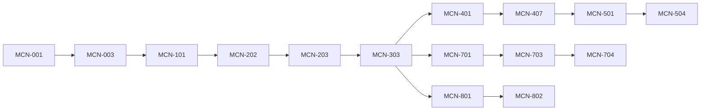

# Delivery Plan

Version 1.0 · 2026-09-21 · Owner: Tech Lead

## 1. Delivery model

- **Lanes, not people.** Work is split into five lanes that own directories: ISS (`issuer-jpos/`), GW (`gateway-go/`), WEB (`web-next/`), SET (`settlement/`), PLAT (`infra/`, `contracts/`, CI). A lane is staffed by one engineer or one Claude Code session.
- **Contract first, then parallel.** Each sprint starts with contract PRs for the sprint's slices (day 1). After they merge, provider and consumer lanes build at the same time: WEB against MSW mocks, GW/ISS against contract tests and golden vectors.
- **Feature slices release together.** A slice pairs the backend story with the frontend story on the same contract. Both merge behind the slice flag; the flag is enabled only when both are done and the integration checkpoint passes.
- **Sprints:** 2 weeks (Sprint 0 = 1 week). Releases per `01-prd.md` §8.

### Capacity

| Constraint | Assumption |
| --- | --- |
| Lane throughput | ≈ 13 points per lane per sprint |
| Review capacity (Tech Lead) | ≈ 35 points per sprint — the real bottleneck |
| Buffer | 15% reserved for bugs, refactoring, doc fixes |
| Commitment | ≤ 30 points per sprint across all lanes |

## 2. Feature slices

| Slice | Backend | Frontend | Contract (merge day 1) | Flag | Release |
| --- | --- | --- | --- | --- | --- |
| S0 | MCN-005 | MCN-004 | health endpoints, shell nav | — | R0 |
| S1 | MCN-103 | MCN-104 | `lab/*` | `FF_S1_MESSAGE_LAB` | R1 |
| S2 | MCN-204 | MCN-205 | `network/*`, WS `link.status`, `network.event` | `FF_S2_NETWORK` | R2 |
| S3a | MCN-303 | MCN-305 | `transactions/purchases`, `terminals`, WS `transaction.*` | `FF_S3A_POS` | R3 |
| S3b | MCN-304 | MCN-306, MCN-307 | `transactions`, `journey`, `metrics/overview` | `FF_S3B_OVERVIEW` | R3 |
| S3c | MCN-308 | MCN-309 | `cards/*` | `FF_S3C_CARDS` | R3 |
| S4a | MCN-401, MCN-402 | MCN-406 | `cancellations`, `network/saf`, journey kinds | `FF_S4A_REVERSAL` | R4 |
| S4b | MCN-404 | MCN-405 | `chaos/*`, WS `chaos.*` | `FF_S4B_CHAOS` | R4 |
| S5 | MCN-501, MCN-504 | MCN-505 | `keys/*` | `FF_S5_KEYS` | R5 |
| S6 | MCN-601, MCN-603 | MCN-604 | `pre-authorizations`, `completions`, `refunds`, `balance-inquiries` | `FF_S6_ADV_TXN` | R6 |
| S7 | MCN-702, MCN-704 | MCN-705 | `settlement/*` | `FF_S7_SETTLEMENT` | R7 |
| S8 | MCN-802 | MCN-804 | `network/switch`, WS `switch.status` | `FF_S8_STIP` | R8 |

## 3. Sprint plan

Parallel waves: stories in the same wave run concurrently in separate worktrees; a later wave starts when its dependencies merge.

| Sprint | Goal | Wave 1 (parallel) | Wave 2 (parallel) | Pts | Release |
| --- | --- | --- | --- | --- | --- |
| 0 (1 wk) | Everyone can build, run and see traces | PLAT MCN-001 (day 1–2) | PLAT MCN-002 ‖ PLAT MCN-003 ‖ WEB MCN-004 → then ISS/GW/SET MCN-005 | 23 | R0 |
| 1 | Learners can dissect any MCN-87A message | GW MCN-101 ‖ ISS MCN-102 ‖ WEB MCN-104 | GW MCN-103 | 19 | R1 |
| 2 | Links connect, sign on and self-heal | ISS MCN-201 ‖ GW MCN-202 ‖ WEB MCN-205 | GW MCN-203 → MCN-204 | 26 | R2 |
| 3 | First purchase flows end to end on mocks and real issuer | ISS MCN-301 → 302a ‖ GW MCN-303 ‖ WEB MCN-305 ‖ WEB MCN-306 | — | 29 | — |
| 4 | Purchase, overview, journey and cards released | ISS MCN-302b ‖ WEB MCN-307 ‖ WEB MCN-309 | GW MCN-304 ‖ ISS MCN-308 | 28 | R3 |
| 5 | Money is safe under every failure | GW MCN-401 ‖ ISS MCN-402 ‖ WEB MCN-405 ‖ WEB MCN-406 | GW MCN-403 → MCN-404 | 30 | — |
| 6 | Chaos proven in CI; security foundations | PLAT MCN-407 ‖ ISS+GW MCN-501 ‖ PLAT MCN-506 | GW MCN-502 ‖ ISS MCN-503 | 26 | R4 |
| 7 | Keys rotate without downtime; advanced txn groundwork | GW+ISS MCN-504 ‖ WEB MCN-505 ‖ ISS MCN-602 ‖ WEB MCN-604 | GW MCN-603 ‖ ISS MCN-803 | 26 | R5 |
| 8 | Holds and events flowing to settlement | ISS MCN-601 ‖ ISS+GW MCN-701 ‖ GW MCN-801 ‖ WEB MCN-705 | SET MCN-703 | 23 | R6 |
| 9 | End-of-day closes cleanly; stand-in works | GW+ISS MCN-702 ‖ SET MCN-704 ‖ GW MCN-802 ‖ WEB MCN-804 | — | 24 | R7 |
| 10 | Operable like production | PLAT MCN-901 ‖ PLAT MCN-903 ‖ ISS/GW/SET MCN-902 | hardening from risk register | 11 + buffer | R8 |
| 11 | v1.0: teachable and fully tested | WEB MCN-904 ‖ WEB MCN-905 | release, demo video, blog | 8 + buffer | R9 |

Sprints 10–11 are intentionally light: they absorb slippage from earlier sprints (Tigers R-01, R-03 in the risk register).

## 4. Dependencies and critical path



Critical path: MCN-001 → 003 → 101 → 202 → 203 → 303 → 401 → 407. A slip here moves R3 and R4; protect it by giving GW the first review slot every day.

Frontend stories have no backend dependency before the integration checkpoint; they depend only on merged contracts.

## 5. Definition of Ready

A story enters a sprint only if:
- [ ] AC are testable and numbered; lane, points, slice and dependencies set
- [ ] Contract changes identified; contract PR drafted for day 1
- [ ] ISO spec / data model sections referenced; migration number reserved if needed
- [ ] Test approach known (unit, integration, contract, E2E)
- [ ] No open question that blocks design (else a brainstorming session is scheduled first)

## 6. Definition of Done

Per story: see root `CLAUDE.md` §7. Per slice additionally:
- [ ] Both stories merged behind the flag
- [ ] Integration checkpoint passed: `make up`, flag on, `NEXT_PUBLIC_API_MOCKS=false`, slice Playwright journey green
- [ ] Demo recorded (30–60 s) and linked in the release notes

Per release: tag `vX.Y.0`, release notes from Conventional Commits, flags of the previous release removed, risk register reviewed, blog post drafted.

## 7. Branching, versioning, flags

- Trunk-based: `main` always releasable; short-lived branches `feat|fix|chore/MCN-<id>-<slug>`, one story each, lifetime ≤ 3 days.
- Contract branches `contract/<slice>-<slug>`, merged before feature branches.
- Squash merge; PR title = Conventional Commit with story id: `feat(gw): purchase flow via MUX (MCN-303)`.
- Semantic versioning for the product (`v0.R.0` until v1.0 at R9); API version `/v1`; ISO spec version MCN-87A v1.
- Flags live in env (`FF_*`), read by services and exposed to the BFF; removed one release after enabling.

## 8. Ceremonies (adapted for a small team with AI lanes)

| Ceremony | When | Output |
| --- | --- | --- |
| Sprint planning | Day 1, 60 min | Sprint goal, committed stories, contract PR list, wave plan |
| Contract review | Day 1–2 | Merged contract PRs; lanes unblocked |
| Daily check | Daily, 15 min async | Per lane: done / next / blocked; review queue order |
| Integration checkpoint | Per slice, when both sides merge | Slice journey green with real backend |
| Review + demo | Last day | Release notes, demo clip |
| Retro | Last day, 30 min | 1–3 actions; update risks and this plan |

## 9. Claude Code playbook

### 9.1 One-time setup

1. Install the Superpowers plugin in Claude Code and confirm the skills load.
2. Clone the repo; create `../mcn-worktrees/`.
3. Keep root and per-service `CLAUDE.md` short; they point to `docs/`.

### 9.2 Sprint start (Tech Lead session, on `main`)

```text
Read docs/07-delivery-plan.md §3 for Sprint <n> and the stories it lists in docs/06-user-stories.md.
For each slice in this sprint, draft the contract PR (contracts/ only): openapi.yaml, ws-events, fixtures, ISO vectors.
Do not touch service code. Use writing-plans for the contract changes, then verification-before-completion
(make contracts). Open one PR per slice.
```

### 9.3 Lane session (one terminal per lane, after contracts merge)

```text
You are the <LANE> lane. Story: MCN-<id>. Read CLAUDE.md, <service>/CLAUDE.md, the story in docs/06,
and the doc sections it references. Follow the Superpowers workflow in CLAUDE.md §4:
using-git-worktrees (branch feat/MCN-<id>-<slug>), writing-plans (docs/plans/MCN-<id>.md),
subagent-driven-development with test-driven-development, verification-before-completion,
requesting-code-review, finishing-a-development-branch.
Only edit files under <service>/ and docs/plans/. If you need a contract change, stop and write a Ruling
in the plan describing the change for the Tech Lead instead of editing contracts/.
```

### 9.4 Parallel dispatch inside a story

Use **dispatching-parallel-agents** only when tasks touch disjoint files, for example in MCN-302a: `ParseAndValidate`, `Deduplicate` and `CheckCard` participants with their tests are independent; `20_txnmgr.xml` wiring is a final sequential task. Each subagent brief contains: the task, exact files it may edit, the failing test to write first, the verification command, and the return format.

### 9.5 Integration checkpoint (Tech Lead session)

```text
Slice <S>: both stories are merged. Run make up with <FLAG>=true and NEXT_PUBLIC_API_MOCKS=false,
run the slice Playwright journey and the contract tests. If anything fails, use systematic-debugging,
identify which side violates the contract, and open a fix story for that lane. Report with command output.
```

### 9.6 Merge order and conflict avoidance

contracts → providers (ISS/GW/SET) → consumers (WEB) → flag on. Migrations are numbered in the plan before coding. Shared files (`Makefile`, `docker-compose.yml`, CI workflow) belong to PLAT; lanes request changes through the Tech Lead.

## 10. Tracking and reporting

- Board columns: Backlog → Ready → In progress (per lane) → In review → Merged (flag off) → Released.
- Burn-up per release; review queue age (target < 1 day).
- Metrics reviewed at retro: cross-lane conflicts (target ≤ 1), WEB days blocked by BE (target 0), escaped defects, CI red time.
